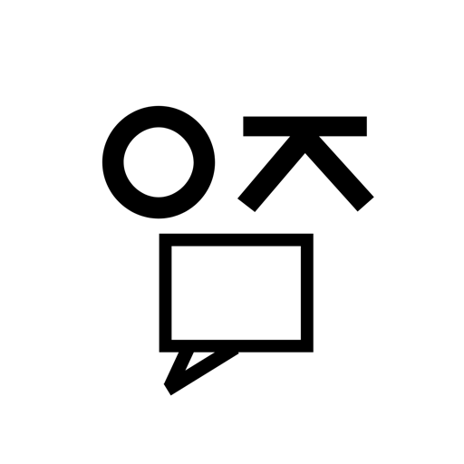

  

<h1 align="center">요즘말</h1>

  그때 우리는 이렇게 말했다.

  <a href="./">Timeline</a> ·
  <a href="./about/">About</a> ·
  <a href="./sources/">Sources</a>

 

## 2020—NOW

한국에서 실제로 사용된 유행어와 인터넷 밈을 시간 위에 기록한 인터랙티브 아카이브입니다.

단어를 누르면 그때의 뜻과 유래, 사용법이 열립니다. 어떤 말에는 화면 뒤편에 남아 있던 원본 장면도 함께 담겨 있습니다.

 

## Archive

**Timeline** — 2020년부터 지금까지 이어지는 한 줄의 기록

**Words** — 뜻, 유래, 사용 상황과 예문

**Frames** — 카드를 뒤집어 만나는 밈의 원본 장면

**Sources** — 기사, 방송, 영상으로 확인한 당시의 흔적

 

## Interaction

**Drag** — 마우스로 누른 채 끌거나 트랙패드와 휠로 이동합니다.

**Touch** — 모바일에서는 손가락으로 타임라인을 넘깁니다.

**Open** — 궁금한 말을 누르면 기록 카드가 열립니다.

**Flip** — 이미지가 있는 카드는 화살표를 눌러 뒤집을 수 있습니다.

 

## Record

날짜는 원본 콘텐츠가 공개되었거나 유행이 널리 확인된 시점을 기준으로 합니다. 정확한 최초 발생일을 특정하기 어려운 표현은 당시의 기사와 방송, 온라인 기록을 함께 살펴 대표 날짜를 정합니다.

인용된 유행어와 원본 콘텐츠의 권리는 각 권리자에게 있습니다.

 

  YOJEUMAL — KOREAN SLANG TIMELINE

